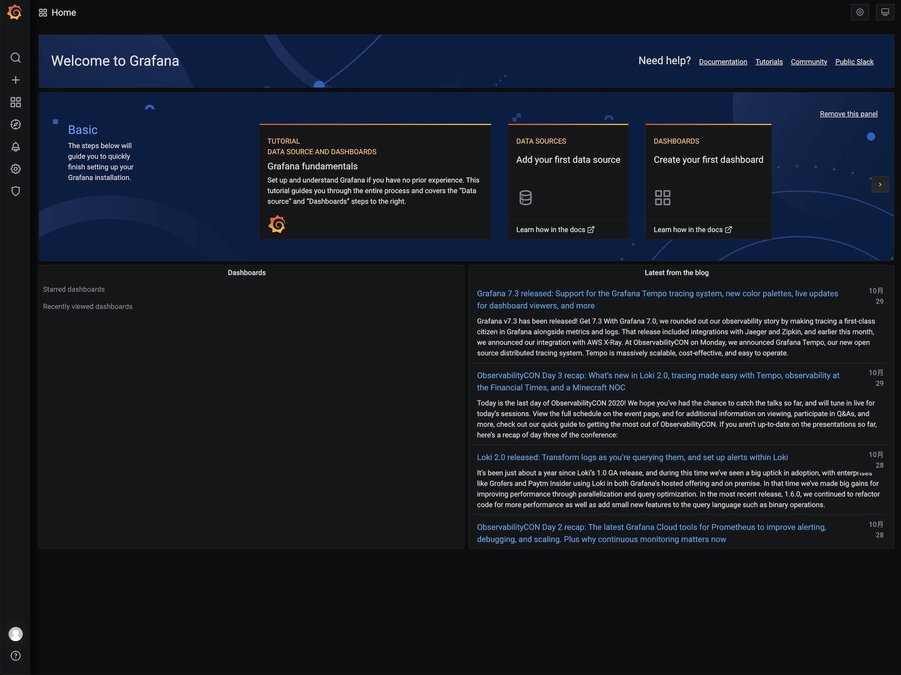

  

# [Grafana](https://github.com/grafana/grafana)

## 介绍

Grafana 是一个开源的时序性统计和监控平台，支持对采集的数据进行可视化的展示，拥有完善的通知、告警机制。

## 部署

本项目基于开源项目 [CloudBase Framework](https://github.com/Tencent/cloudbase-framework) 开发部署，支持一键云端部署

### 配置

- `GF_DATABASE_NAME`：数据库名称
- `GF_DATABASE_HOST`：数据库 Host
- `GF_DATABASE_USER`：数据库用户
- `GF_DATABASE_PASSWORD`：数据库密码

更多配置参考文档：https://grafana.com/docs/grafana/latest/administration/configuration/

### 依赖

- CynosDB：使用 CynosDB 数据库存储数据
- CFS：需要使用 CFS 持久化配置数据

## 注意事项

1. 部署时，需要将服务路径设置为根路径 `/`
2. Grafana 默认使用 SQLite3 存储用户和 dashboard 数据，为了更高的可用性，部署将使用 CynosDB 数据库
